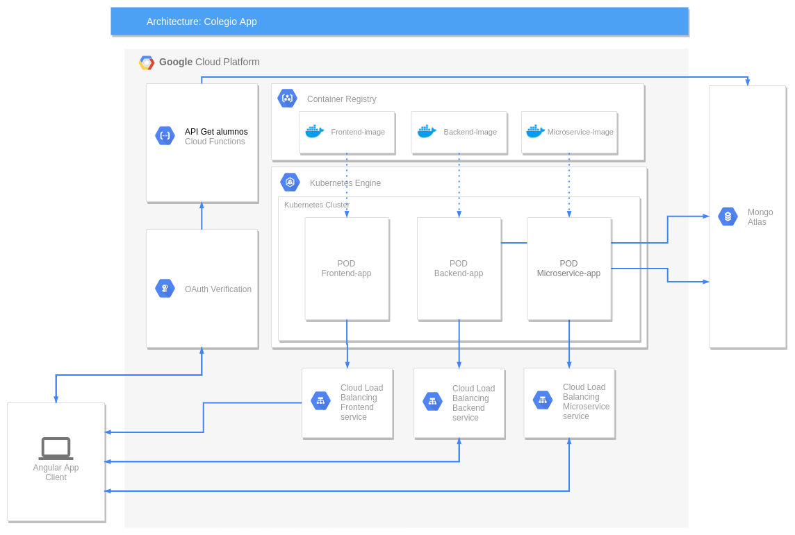

# _Administración de colegios_

#### Materia: _TC3059 Desarrollo de aplicaciones en la nube_

##### Campus: _Santa Fe_

##### Integrantes:

1. [Joan Andoni González Rioz](https://github.com/JoanAndoni)
2. [Daniel Charua García](https://github.com/dcharua)

---

## 1. Aspectos generales

### 1.1 Requerimientos técnicos

- MongoDB 3.6.9

- node.js 11.9.0
- npm 6.5.0

- Angular CLI: 7.0.4
- rxjs 6.3.3

- Docker 18.09.2

- Minikube 1.0.0

- Google SDK

### 1.2 Estructura del repositorio

```
- / 			        # Raíz de todo el proyecto
    - README.md			# Archivo con los datos del proyecto (Este archivo)
    - frontend			# Carpeta con la solución del frontend (Web app)
    - backend			  # Carpeta con la solución del backend (CMS)
    - api			      # Carpeta con la solución de la API
    - microservices	      # Carpeta con los micro servicios desarrollados y desplegados para nuestra solución
    - backend/models	  # Carpeta donde se almacenarán los modelos de la base de datos
```

### 1.3 Documentación del proyecto

Como parte de la entrega final del proyecto, se debe incluir la siguiente información:

- Descripción del problema a resolver.

- Diagrama con la arquitectura de la solución.

- Descripción de cada uno de los componentes de la arquitectura.

- Justificación de los componentes seleccionados.

- Explicación del flujo de información en la arquitectura.

- Descripción de las fuentes de información utilizadas (archivos CSV, JSON, TXT, bases de datos, entre otras).

- Guía de configuración, instalación y despliegue de la solución en la plataforma en la nube seleccionada.

- Documentación de la API. Puede ver un ejemplo en [Swagger](https://swagger.io/).

- El código debe estar documentado siguiendo los estándares definidos para el lenguaje de programación seleccionado.

## 2. Descripción del proyecto

El proyecto consiste en la administración de alumnos y profesoresen una escuela para su comunicación con los padres de familia.

Existen tres roles diferentes dentro del sistema:

1. Profesor
2. Alumno
3. Administrador

Cada profesor tiene asignadas materias por grado y grupo, y cada alumno tiene asignadas diferentes materias.

El profesor puede asignarle a cada alumno la calificación correspondiente a cada trimestre de la materia, así como comentarios relevantes respecto a las clase.

El alumno puede consultar sus calificaciones y los comentarios recibidos por parte de los profesores.

El administrador puede agregar nuevos profesores, alumnos y clases. Puede aceptar, rechazar o modificar los comentarios creados por los profesores. Crear un nuevo perfil de administrador o eliminar su perfil de administrador.

## 3. Solución

A continuación aparecen descritos los diferentes elementos que forman parte de la solución del proyecto.

### 3.1 Arquitectura de la solución



_[Incluya aquí un diagrama donde se aprecie la arquitectura de la solución propuesta, así como la interacción entre los diferentes componentes de la misma.]_

_[Incluya una explicación del flujo de la información entre los diferentes componentes.]_

### 3.2 Descripción de los componentes

#### 3.2.1 Componentes generales
##### 3.2.1.1 Home Component
##### 3.2.1.2 Login Component
##### 3.2.1.3 Navbar Component
##### 3.2.1.4 Profile Component

#### 

#### 3.2.3 Add Alumno Component
#### 3.2.4 List Alumnos Component
#### 3.2.5 Ver Alumno Component
#### 3.2.6 Home Component
#### 3.2.7 Home Component
#### 3.2.8 Home Component

### 3.3 Frontend

El frontend esta desarrollado en Angular el cual es muy util para procesar la información obtenida y poder crear un proyecto dinámico para su uso. Se tomó la decisión de usar este framework ya que es de los más comunes entre la comunidad de desarrolladores, así mismo tienes la posibilidad de convertirlo en una app hibrida usando Ionic con unas modificaciones menores, así creando una interfaz completa para cumplir los objetivos de la solución del proyecto.

#### 3.3.1 Lenguaje de programación

Los lenguajes de programación utilizados para el desarrollo del frontend fueron: HTML y TypeScript.

#### 3.3.2 Framework

El framework utilizado para el desarrollo del frontend fue: [Angular](https://angular.io/). Es un framework de código abierto, para el desarrollo de aplicaciones web de una sola página.

#### 3.3.3 Librerías de funciones o dependencias

Para el diseño de las pantallas botones y assets de la aplicación se utilizó [Bootstrap](https://getbootstrap.com/) con sus modificaciones necesarias para una mejor visualización y UI.

Una de las librerias mas importantes es RXJS ya que es un dependencia que te permite hacer peticiones http y procesarlas para que puedas ocupar la información que necesites de las bases de datos que procesa el backend y los microservicios.

### 3.4 Backend

Para el backend nosotros utilizamos NodeJS que es un entorno de ejecución de javascript, de codigo abierto que nos permite instalar dependencias con npm y así utilizamos las dependencias necesarias para crear un servidor para la conexión del backend con el frontend ademas de crear las peticiones a la base de datos.

#### 3.4.1 Lenguaje de programación

El lenguaje de programación utilizado para el desarrollo del backend fue: [JavaScript](https://www.javascript.com/).

#### 3.4.2 Framework

El frameworks utilizado para el desarrollo del backend fueron: [Express](https://expressjs.com/es/) y [NodeJs](https://nodejs.org/es/). NodeJs es un entrono de código abierto para la capa del servidor, mientras que Express es una infraestructura de aplicaciones web de NodeJs.

#### 3.4.3 Librerías de funciones o dependencias

Todas las dependencuas se encuentran en el archivo "package.json"

- [Braces](https://www.npmjs.com/package/braces)

- [Mail Service for the Sendgrid v3 Web API](https://www.npmjs.com/package/@sendgrid/mail)

- [Express Handlebars](https://www.npmjs.com/package/express-handlebars)

- [Method Overrides](https://www.npmjs.com/package/method-override)

- [Nodemon](https://www.npmjs.com/package/nodemon)

- [Bcryptjs](https://www.npmjs.com/package/bcryptjs)

- [Body Parser](https://www.npmjs.com/package/body-parser)

- [Cors](https://www.npmjs.com/package/cors)

- [Jsonwebtoken](https://www.npmjs.com/package/jsonwebtoken)

- [Mongoose](https://www.npmjs.com/package/mongoose)

- [Passport](https://www.npmjs.com/package/passport)

- [Passport-jwt](http://www.passportjs.org/packages/passport-jwt/)

### 3.5 API

_[Incluya aquí una explicación de la solución utilizada para implementar la API del proyecto. No olvide incluir las ligas o referencias donde se puede encontrar información de los lenguajes de programación, frameworks y librerías utilizadas.]_

#### 3.5.1 Lenguaje de programación

#### 3.5.2 Framework

#### 3.5.3 Librerías de funciones o dependencias

_[Incluya aquí una explicación de cada uno de los endpoints que forman parte de la API. Cada endpoint debe estar correctamente documentado.]_

_[Por cada endpoint debe incluir lo siguiente:]_

- **Descripción**:
- **URL**:
- **Verbos HTTP**:
- **Headers**:
- **Formato JSON del cuerpo de la solicitud**:
- **Formato JSON de la respuesta**:

## 3.6 Pasos a seguir para utilizar el proyecto

### Para ejecutarlo local

1. Clonar el repositorio de GitHub

`git clone https://github.com/tec-csf/TC3059-PF-Otono-2019-equipo1.git`

2. Cambiarse a la carpeta del backend del proyecto

`cd TC3059-PF-Otono-2019-equipo1/backend`

3. Instalar las dependencias de NodeJs para el backend

`npm install`

4. Iniciar la app del backend de la API Rest

`npm start`

5. Abrir otra terminal y cambiarse a la carpeta del frontend del proyecto

`cd TC3059-PF-Otono-2019-equipo1/frontend`

6. Instalar las dependencias de NodeJs para el frontend

`npm install`

7. Iniciar el frontend de la aplicación.

`ng serve`

8. Abrir el navegador en el puerto 4200 para ver la aplicación funcionando

http://localhost:4200

### Para ejecutarlo en la nube (Google Cloud)

#### En GCLOUD console

1. Entra a la consola de Google Cloud Platform (GCP) 

https://console.cloud.google.com

2. Crea un proyecto en el cual se desplegará la aplicación

3. Abre la terminal de GCP

4. Clona el repositorio de Gitub

`git clone https://github.com/tec-csf/TC3059-PF-Otono-2019-equipo1.git`

5. Dentro de la plataforma entra a Compute/Kubernetes Engine y crea un nuevo cluster

#### En tu computadora

1. Clonar el repositorio de github

`git clone https://github.com/tec-csf/TC3059-PF-Otono-2019-equipo1.git`

2. Cambiarse a la carpeta del frontend del proyecto

`cd TC3059-PF-Otono-2019-equipo1/frontend`

3. Crear la imagen del frontend usando el comando

`docker build . --tag gcr.io/[ID del proyecto de GCP]/frontend-image`

4. Dar push a la imagen del frontend usando el comando

`gcloud docker -- push gcr.io/[ID del proyecto de GCP]/frontend-image`

5. Cambiarse a la carpeta del backend del proyecto

`cd ../backend`

6. Crear la imagen del backend usando el comando

`docker build . --tag gcr.io/[id del proyecto de GCP]/backend-image`

7. Dar push a la imagen del backend usando el comando

`gcloud docker -- push gcr.io/[ID del proyecto de GCP]/backend-image`

#### En GCLOUD console

1. Modifica el archivo "appDeployment.yaml"; cambia el nombre de la imagen del frontend y la del backend

Línea 37
`imagen: gcr.io/[ID del proyecto de GCP]/frontend-image`

Línea 42
`imagen: gcr.io/[ID del proyecto de GCP]/backend-image`

2. Crea la conexión con el cluster creado previamente

`gcloud container clusters get-credentials [Nombre del cluster] --zone [Zona del cluster] --project [ID del proyecto de GCP]`

3. Desplegar la aplicación en el cluster

`kubectl apply -f appDeployment.yaml`

4. Comprobar que el pod está funcionando correctamente (El Status debe ser Running)

`kubectl get pods`

5. Obtener la dirección ip externa y el puerto

`kubectl get service`

6. Exponer la apliación a internet

`kubectl expose deployment colegio-app --type=LoadBalancer --port 80 --target-port 4200`

7. Acceder a la aplicación en un browser

`http://[IP externa de colegio-app]`

## 4. Referencias

1. [Conexión con Mongoose](https://mongoosejs.com/docs/guide.html)
2. [Crear un contenedor de docker con Angular](https://scotch.io/tutorials/create-a-mean-app-with-angular-2-and-docker-compose)
3. [Crear un contenedor de docker con Node.js](https://nodejs.org/en/docs/guides/nodejs-docker-webapp/)
4. [Implementar una aplicación web en contenedor](https://cloud.google.com/kubernetes-engine/docs/tutorials/hello-app)
5. [Pushing and pulling images](https://cloud.google.com/container-registry/docs/pushing-and-pulling)
